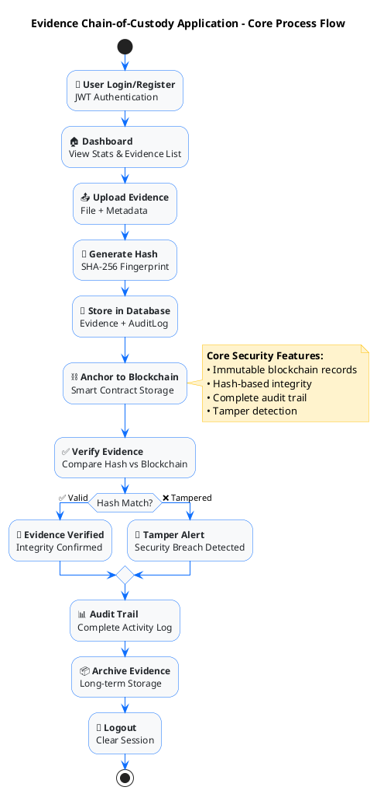

# Evidence Chain-of-Custody - Concise Process Flow (PowerPoint Ready)

## Key Features Highlighted:

### 🔐 **Authentication**
- Secure JWT-based login system

### 📤 **Evidence Management** 
- Upload files with metadata
- Automatic hash generation for integrity

### ⛓️ **Blockchain Security**
- Immutable evidence anchoring
- Smart contract integration

### ✅ **Verification System**
- Hash comparison for tamper detection
- Real-time integrity checking

### 📊 **Audit & Compliance**
- Complete activity logging
- Regulatory compliance ready

### 📦 **Lifecycle Management**
- Evidence archival system
- Long-term preservation