# Evidence Chain-of-Custody - Simple Architecture (Presentation Ready)

```plantuml
@startuml
title Evidence Chain-of-Custody - Core Architecture

skinparam component {
  BackgroundColor #f8f9fa
  BorderColor #0d6efd
  FontColor #212529
  FontSize 14
}
skinparam database {
  BackgroundColor #e7f3ff
  BorderColor #0066cc
}
skinparam cloud {
  BackgroundColor #fff3e0
  BorderColor #ff9800
}

package "Frontend" {
  [Web App\n(React)] as WEB
}

package "Backend" {
  [API Server\n(Node.js + Express)] as API
  [Authentication\n(JWT)] as AUTH
}

package "Storage" {
  database "Database\n(MongoDB)" as DB {
    [Evidence Records]
    [User Data]
    [Audit Logs]
  }
}

package "Blockchain" {
  cloud "Smart Contract\n(Ethereum)" as BC {
    [Evidence Hash Storage]
    [Immutable Verification]
  }
}

' Core connections
WEB --> API : HTTPS/REST API
API --> AUTH : Secure Login
API --> DB : Store Evidence
API --> BC : Anchor Hash
BC --> API : Verify Integrity

note top of WEB
**User Interface:**
• Upload Evidence
• View & Verify
• Audit Trail
end note

note right of API
**Core Functions:**
• File Hash Generation
• Evidence Management
• Tamper Detection
end note

note bottom of DB
**Data Storage:**
• Evidence metadata
• Complete audit trail
• User permissions
end note

note bottom of BC
**Blockchain Security:**
• Immutable hash storage
• Cryptographic proof
• Tamper prevention
end note

@enduml
```

## **Core Architecture - 4 Simple Components:**

### 🖥️ **Frontend (React Web App)**
- User interface for evidence upload, viewing, and verification
- Real-time integrity status display

### ⚙️ **Backend (Node.js API)**
- JWT authentication and authorization
- File hash generation (SHA-256)
- Evidence management and tamper detection

### 💾 **Database (MongoDB)**
- Evidence records with metadata
- Complete audit trail for compliance
- User data and permissions

### ⛓️ **Blockchain (Ethereum Smart Contract)**
- Immutable hash storage
- Cryptographic integrity verification
- Tamper-proof evidence anchoring

---

## **Simple Data Flow:**
1. **Upload** → Generate hash → Store in DB
2. **Anchor** → Save hash to blockchain (immutable)
3. **Verify** → Compare DB hash vs blockchain hash
4. **Alert** → Flag tampering if hashes don't match

**Key Benefits:** Combines traditional database performance with blockchain security for bulletproof evidence integrity.